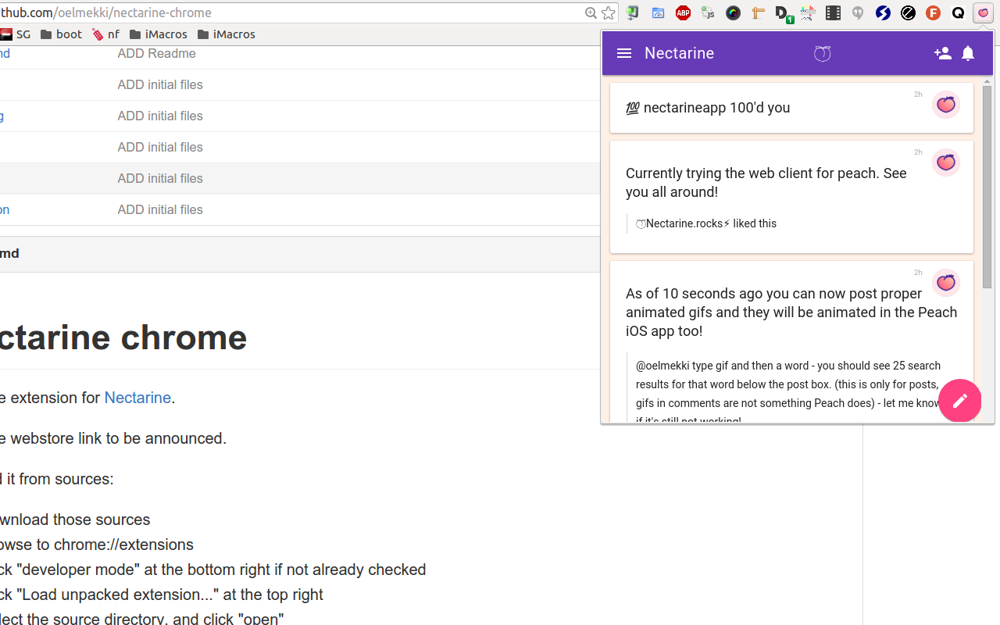

# Nectarine chrome

Chrome extension for [Nectarine](http://nectarine.rocks).

## Install

[Install from chrome webstore](https://chrome.google.com/webstore/detail/nectarine/pcdklgbmhjbfhpnfnnohjomdlnpnfhnb).

To install from sources:

1. download those sources
2. browse to [chrome://extensions](chrome://extensions)
3. click "developer mode" at the top right if not already checked
4. click "Load unpacked extension..." at the top left
5. select the source directory, and click "open"

You're done, enjoy :)
